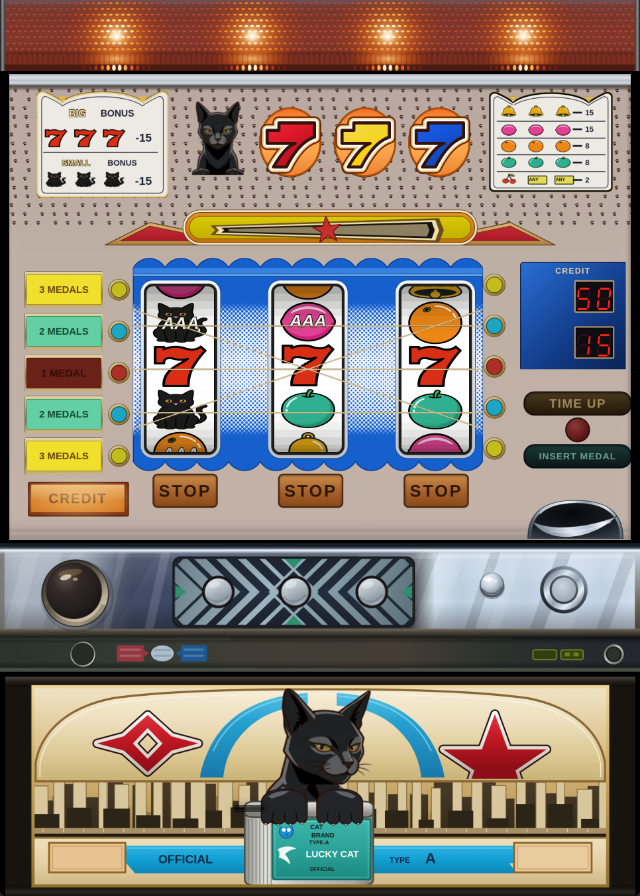

# Retro Pachislot Emulator

<p align="center"></p>

<p align="center"><sub>The artwork is original to this project and intentionally differs from the real machine's design, out of respect for its copyright.<br>アートワークは実機のデザインの著作権に配慮し、本プロジェクト用に独自に作成したもので、実機とは異なります。</sub></p>

[日本語は下にあります](#日本語)

Retro Pachislot Emulator plays classic Japanese pachislot (medal slot)
machines on a PC, with the whole cabinet drawn on screen: reels, lamps,
payline plates, credit counter and control panel.

It is built on [MAME](https://www.mamedev.org/) and is not affiliated with or
endorsed by the MAME development team.

The cabinet artwork is not a copy of the real machine. Out of respect for the
copyright in its printed design, all artwork was created for this project and
differs from the original: the layout of the parts follows the real machine,
but the illustrations, lettering and symbols are new.

## Why

More than 30 years have passed since the second and third generations of
pachislot machines (known in Japan as "type 2" and "type 3" machines) came
out, and working units are getting hard to find even on the second-hand
market. This project aims to preserve these machines in a working, playable
form.

## Supported machines

| System name | Machine | Status |
|---|---|---|
| `wildcats` | Wild Cats (Ark Technico, 1991, type 3-1) | Playable |
| - | Crazy Bubbles (Ark Technico, type 2-2) | WIP (not playable yet) |

## ROM required

**This project does not include or distribute any ROM.** To play, you need
the program ROM dumped from a real machine's board that you own. Please do
not ask for ROMs, and do not share them.

| System | File | Size | CRC32 | SHA-1 |
|---|---|---|---|---|
| `wildcats` | `wildcats-ndk.bin` | 8,192 bytes | `362b3e92` | `40aa96dded5a55865892868fd09cf5af4c909c85` |

Place it in one of these (either works):

```
roms/wildcats.zip            (a zip containing wildcats-ndk.bin)
roms/wildcats/wildcats-ndk.bin
```

If the CRC32 / SHA-1 do not match, the emulator warns about wrong checksums
and the machine may not work correctly.

## Getting started

1. On Windows, download `retropachislotemu-<version>-windows-x64.zip` from the
   [Releases](https://github.com/gregre365/retro-pachislot-emulator/releases)
   page and extract it. Otherwise build `retropachislotemu` (see
   [Building](#building)). The executable is not signed, so Windows may show
   a SmartScreen warning the first time you run it.
2. Put the ROM in `roms/` as described in [ROM required](#rom-required).
3. Run from the folder that contains `roms/` and `artwork/`
   (both are looked up relative to the current folder):

   ```
   ./retropachislotemu wildcats          (Linux)
   .\retropachislotemu.exe wildcats      (Windows, PowerShell)
   ```

   To run from somewhere else, pass the paths, for example:
   `./retropachislotemu wildcats -rompath <path>/roms -artpath <path>/artwork`

Credits, bonus state and settings are kept when you quit, just like the real
machine keeps them across a power cut.

### Controls (default keys)

| Key | Action |
|---|---|
| 5 | Insert medal |
| M | Bet |
| 1 | Start lever |
| A / S / D | Stop left / centre / right reel |
| 4 | Payout |
| F2 | Setting key |
| 9 | Setting change switch |
| 0 | Reset (door key) |

Keys can be changed from the in-emulator menu (Tab).

### Views

- **Wild Cats (cabinet)** - the full cabinet front (default)
- **Glass Panel** - only the illuminated panel with the reels
- **Debug Overlay** - the panel plus LEDs for reel sensors, hopper, coin
  lockout and hall computer outputs, and the medals-in minus medals-out
  count, for developers

## Building

Build settings for this project are in `useroptions.mak`
(`SUBTARGET = wildcats`), so a plain `make` builds only what is needed.
Install the build tools described in the
[MAME compiling guide](https://docs.mamedev.org/initialsetup/compilingmame.html)
first.

### Linux

```
make -j$(nproc)
```

### Windows (MSYS2)

With MSYS2 installed in `C:\msys64`, run from PowerShell:

```
.\build.ps1
```

`.\build.ps1 -Jobs 8`, `.\build.ps1 -DebugBuild` and
`.\build.ps1 -Target clean` are also available.

### Windows executable from Linux (cross build)

Requires `gcc-mingw-w64-x86-64-posix` and `g++-mingw-w64-x86-64-posix`.

```
make -j$(nproc) CROSS_WINDOWS=1
```

## Customizing the artwork

Everything you see is a plain image in `artwork/`, so you can change the look
with any image editor. No rebuild is needed; just restart the emulator.

- `wc_panel_bg.png`, `wc_cp_bg.png`, `wc_tl_bg.png`, `wc_lp_panel.png` -
  backgrounds (everything that never lights up)
- `wc_*_on.png`, `wc_*_glow_on.png`, `wc_*_lit.png` - lit images drawn over
  the background when a lamp turns on
- `wc_<symbol>.png`, `wc_<symbol>_aaa.png` - reel symbols

The two large backgrounds are assembled from separate pieces in
`artwork/sources/`. After editing a piece, rebuild the background with:

```
python3 tools/compose_artwork.py tools/manifests/panel_bg.json
python3 tools/compose_artwork.py tools/manifests/cp_bg.json
```

This needs ImageMagick, and headless Chrome for SVG pieces. See
`tools/manifests/README.md` for details.

Save PNG files with 8 bits per channel. 16-bit PNGs are not drawn correctly.

## Differences from MAME

This tree is MAME 0.289 with the following changes.

- **Wild Cats driver (new).** `src/mame/arktechnico/wildcats.cpp`,
  `wildcats_reel.cpp` and `wildcats_reel.h` emulate the machine; it is not in
  MAME 0.289.
- **Power-off sequence (MAME core change).** The real machine keeps credits
  and bonus state across a power cut: when the power-off signal is asserted,
  the firmware saves the CPU context to backed-up RAM and halts. Upstream
  MAME simply exits, so that context is never saved and the next start is a
  cold start. `running_machine` (`src/emu/machine.cpp`, `machine.h`) gains a
  hook that lets a driver run such a sequence before exiting. On quit, the
  driver asserts the signal, waits for the firmware to report that the
  backup is done, then exits, and the game resumes on the next start.
  - If the firmware does not answer within 500 ms, the emulator exits anyway.
  - Further quit requests while it runs are ignored; a CPU stopped in the
    debugger skips the sequence.
  - With `-autosave`, the sequence is skipped because the save state already
    keeps the whole machine.
- **No YM2413 instrument ROM (MAME core change).** Upstream MAME needs a
  dump of the YM2413's internal voice ROM, which cannot be redistributed.
  `src/devices/sound/ymopl.cpp` is changed to never load it and always use
  the copyright-free voice table built into ymfm, so no extra file is
  needed. Wild Cats mostly plays a user-defined voice, but some sounds use
  the internal voices and may differ slightly from a real YM2413.
- **Layout.** `wildcats_artwork.lay` draws the cabinet from the images in
  `artwork/`. The upstream text-only `wildcats.lay` is kept but not used.
- **Build and naming.** Only this driver is built (`SUBTARGET = wildcats`).
  The executable is `retropachislotemu`, the settings file is
  `retropachislot.ini`, and the Windows build has its own icon and version
  information (`scripts/src/main.lua`, `src/mame/wildcats.cpp`,
  `scripts/build/verinfo.py`, `scripts/resources/windows/mame/`).

## License

- Program code: as MAME, the project as a whole is under the
  [GNU General Public License, version 2](docs/legal/GPL-2.0) or later.
  Individual source files carry their own license headers. New code files
  for this project (driver, `build.ps1`) are BSD-3-Clause.
- Layout (`src/mame/layout/wildcats_artwork.lay`), the `artwork/wc_*.png`
  images, everything in `artwork/sources/`, `tools/` (artwork compositing
  tool and manifests) and the Windows icon images
  (`scripts/resources/windows/mame/retropachislotemu.ico`, `.svg`,
  `_small.svg`, `_16.png`):
  [CC0](docs/legal/CC0) (public domain dedication). The other files in
  `artwork/` come from MAME.

MAME is a registered trademark of Gregory Ember. Machine and manufacturer
names are used only to identify the hardware being emulated; this project is
not affiliated with or endorsed by their owners. The artwork was made for this
project and is not taken from the original machine.

The reel symbol images were generated with Google Gemini (Nano Banana). The
other artwork was created with Claude Code (Anthropic).

---

## 日本語

Retro Pachislot Emulator は、昔のパチスロ実機を PC で遊べるエミュレーターです。
リール、ランプ、有効ラインの表示板、クレジット表示、操作パネルまで、筐体全体を
画面に再現します。

[MAME](https://www.mamedev.org/) をベースにしていますが、MAME 開発チームとは
関係がなく、公認を受けたものでもありません。

筐体のアートワークは実機の複製ではありません。実機に印刷されたデザインの著作権に
配慮し、すべて本プロジェクト用に作成したもので、実機とは異なります。部品の配置は
実機に合わせていますが、イラスト、文字、図柄は新しく描き起こしたものです。

## このプロジェクトについて

パチスロの2号機・3号機が登場してから30年以上が経ち、中古市場でも実機を
手に入れるのが難しくなっています。本プロジェクトは、当時の機械を動作する形で
残すことを目的としています。

## 対応機種

| システム名 | 機種 | 状態 |
|---|---|---|
| `wildcats` | ワイルドキャッツ（アークテクニコ 3-1号機、1991年） | プレイ可能 |
| - | クレイジーバブルス（アークテクニコ 2-2号機） | 開発中（まだ遊べません） |

## ワイルドキャッツ実機のROMが必要です

**このプロジェクトは ROM を同梱・配布していません。** 遊ぶには、ご自身が所有する
実機の基板から吸い出したプログラム ROM が必要です。ROM の提供には
応じられませんので、ご了承ください。また、ROM の共有もご遠慮ください。

| システム | ファイル名 | サイズ | CRC32 | SHA-1 |
|---|---|---|---|---|
| `wildcats` | `wildcats-ndk.bin` | 8,192 バイト | `362b3e92` | `40aa96dded5a55865892868fd09cf5af4c909c85` |

次のどちらかの形で置いてください。

```
roms/wildcats.zip            （wildcats-ndk.bin を入れた zip）
roms/wildcats/wildcats-ndk.bin
```

CRC32 / SHA-1 が一致しない場合は、チェックサムが違うという警告が出て、正しく動かないことがあります。

## 使い方

1. Windows の場合は、[Releases](https://github.com/gregre365/retro-pachislot-emulator/releases)
   ページから `retropachislotemu-<バージョン>-windows-x64.zip` をダウンロードして展開します。
   それ以外は `retropachislotemu` をビルドします（[ビルド方法](#ビルド方法)）。
   実行ファイルには署名がないため、初回起動時に Windows の SmartScreen の警告が出ることがあります。
2. ROM を `roms/` に置きます（[ワイルドキャッツ実機のROMが必要です](#ワイルドキャッツ実機のromが必要です) を参照）。
3. `roms/` と `artwork/` があるフォルダーで起動します
   （どちらも、起動したときのフォルダーを基準に探します）。

   ```
   ./retropachislotemu wildcats          （Linux）
   .\retropachislotemu.exe wildcats      （Windows、PowerShell）
   ```

   別の場所から起動する場合は、次のようにパスを指定します。
   `./retropachislotemu wildcats -rompath <パス>/roms -artpath <パス>/artwork`

終了してもクレジット、ボーナスの状態、設定は保持されます。実機が停電しても
状態を保つのと同じ仕組みです。

### 操作（初期設定のキー）

| キー | 操作 |
|---|---|
| 5 | メダル投入 |
| M | ベット |
| 1 | スタートレバー |
| A / S / D | 左 / 中 / 右リール停止 |
| 4 | 精算 |
| F2 | 設定キー |
| 9 | 設定変更スイッチ |
| 0 | リセット（ドアキー） |

キーはエミュレーター内のメニュー（Tab キー）で変更できます。

### 表示モード

- **Wild Cats (cabinet)** - 筐体の正面全体（標準）
- **Glass Panel** - リールのある表示パネルだけ
- **Debug Overlay** - 表示パネルに加えて、リールセンサー、ホッパー、
  メダルブロッカー、ホールコンピューター出力の状態を LED で、投入枚数と払い出し枚数の
  差を数字で表示する開発者向け画面

## ビルド方法

このプロジェクト用のビルド設定は `useroptions.mak`（`SUBTARGET = wildcats`）に
入っているので、`make` だけで必要な部分がビルドされます。先に
[MAME のビルドガイド](https://docs.mamedev.org/initialsetup/compilingmame.html)
に沿ってビルドツールを入れてください。

### Linux

```
make -j$(nproc)
```

### Windows（MSYS2）

MSYS2 を `C:\msys64` に入れた状態で、PowerShell から実行します。

```
.\build.ps1
```

`.\build.ps1 -Jobs 8`（並列数）、`.\build.ps1 -DebugBuild`（デバッグビルド）、
`.\build.ps1 -Target clean`（クリーン）も使えます。

### Linux で Windows 用の exe を作る（クロスビルド）

`gcc-mingw-w64-x86-64-posix` と `g++-mingw-w64-x86-64-posix` が必要です。

```
make -j$(nproc) CROSS_WINDOWS=1
```

## アートワークの変更

画面に見えるものはすべて `artwork/` の画像なので、好きな画像編集ソフトで
見た目を変えられます。ビルドし直す必要はなく、エミュレーターを再起動するだけで
反映されます。

- `wc_panel_bg.png`、`wc_cp_bg.png`、`wc_tl_bg.png`、`wc_lp_panel.png` -
  背景（光らない部分すべて）
- `wc_*_on.png`、`wc_*_glow_on.png`、`wc_*_lit.png` - ランプが点いたときに
  背景の上に重ねる画像
- `wc_<図柄>.png`、`wc_<図柄>_aaa.png` - リール図柄

大きな背景2枚は、`artwork/sources/` にある部品から合成しています。部品を
編集したら、次のコマンドで背景を作り直してください。

```
python3 tools/compose_artwork.py tools/manifests/panel_bg.json
python3 tools/compose_artwork.py tools/manifests/cp_bg.json
```

ImageMagick と、SVG の部品を使う場合はヘッドレス Chrome が必要です。詳しくは
`tools/manifests/README.md` を見てください。

PNG は各色 8bit で保存してください。16bit の PNG は正しく表示されません。

## MAME との違い

このツリーは MAME 0.289 に次の変更を加えたものです。

- **Wild Cats のドライバ（新規）** `src/mame/arktechnico/wildcats.cpp`、`wildcats_reel.cpp`、
  `wildcats_reel.h` でこの機種をエミュレートします。MAME 0.289 には含まれていません。
- **電源断シーケンス（MAME コアの改変）** 実機は停電してもクレジットやボーナスの
  状態を保ちます。電源断信号が入ると、ファームウェアが CPU の状態をバックアップ
  RAM に保存して停止する仕組みです。本家 MAME はそのまま終了するため、この保存が
  行われず、次回は最初からの起動になります。そこで `running_machine`
  （`src/emu/machine.cpp`、`machine.h`）に、終了前にドライバが処理を挟める仕組みを
  追加しました。終了操作をすると、ドライバが電源断信号を入れ、ファームウェアが
  保存完了を知らせてから終了します。次回の起動では、そのゲームの続きから始まります。
  - ファームウェアが 500 ミリ秒以内に応答しない場合は、そのまま終了します。
  - シーケンス中の追加の終了操作は無視します。デバッガで CPU を止めている場合は、
    シーケンスを行わずに終了します。
  - `-autosave` を使っている場合は、ステートセーブがマシン全体を保存するので、
    このシーケンスは行いません。
- **YM2413 の音色 ROM を使わない（MAME コアの改変）** 本家 MAME は YM2413 の
  内蔵音色 ROM のダンプを必要としますが、これは再配布できません。そこで
  `src/devices/sound/ymopl.cpp` を変更し、この ROM を読み込まず、常に ymfm に
  組み込まれている著作権フリーの音色テーブルを使うようにしました。追加のファイルは
  不要です。Wild Cats の音はほとんどがユーザー定義音色ですが、一部は内蔵音色を
  使うため、実機の YM2413 と音色が少し異なる可能性があります。
- **レイアウト** `wildcats_artwork.lay` で、`artwork/` の画像から筐体を描きます。
  本家向けの文字だけの `wildcats.lay` も残してありますが、使っていません。
- **ビルドと名前** このドライバだけをビルドします（`SUBTARGET = wildcats`）。
  実行ファイルは `retropachislotemu`、設定ファイルは `retropachislot.ini` で、
  Windows 版には専用のアイコンとバージョン情報を付けています（`scripts/src/main.lua`、
  `src/mame/wildcats.cpp`、`scripts/build/verinfo.py`、`scripts/resources/windows/mame/`）。

## ライセンス

- プログラム: MAME と同じく、プロジェクト全体として
  [GNU General Public License バージョン2](docs/legal/GPL-2.0) 以降です。
  各ソースファイルのライセンスは、それぞれの先頭に書いてあります。このプロジェクトで
  追加したコード（ドライバ、`build.ps1`）は BSD-3-Clause です。
- レイアウト（`src/mame/layout/wildcats_artwork.lay`）、`artwork/wc_*.png` の画像、
  `artwork/sources/` の中身、`tools/`（アートワーク合成ツールとマニフェスト）、
  Windows のアイコン画像（`scripts/resources/windows/mame/` の `retropachislotemu.ico`、`.svg`、
  `_small.svg`、`_16.png`）:
  [CC0](docs/legal/CC0)（著作権を放棄し、パブリックドメインとして提供）。
  `artwork/` のそれ以外のファイルは MAME 由来です。

MAME は Gregory Ember の登録商標です。機種名とメーカー名は、エミュレートしている
ハードウェアを示すためだけに使っており、それらの権利者とは関係がなく、公認を
受けたものでもありません。アートワークはこのプロジェクトのために作ったもので、
実機の印刷物から取ったものではありません。

リール図柄の画像は Google Gemini（Nano Banana）で生成しました。それ以外の
アートワークは Claude Code（Anthropic）で作成しました。
